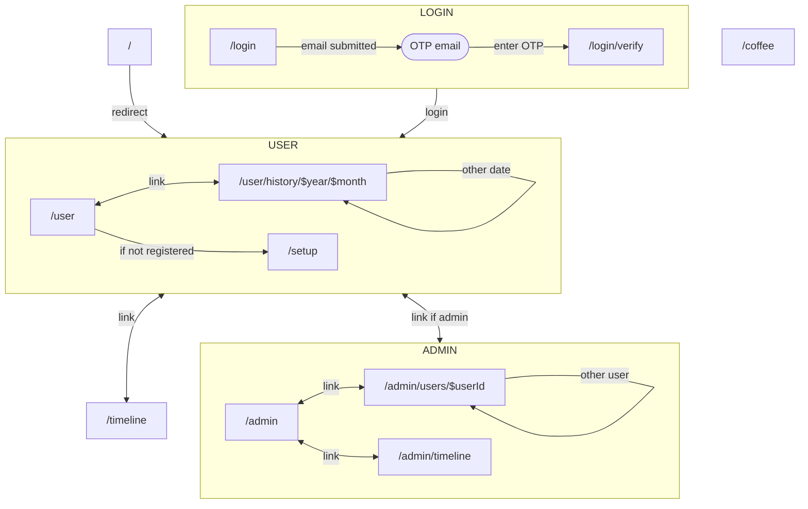
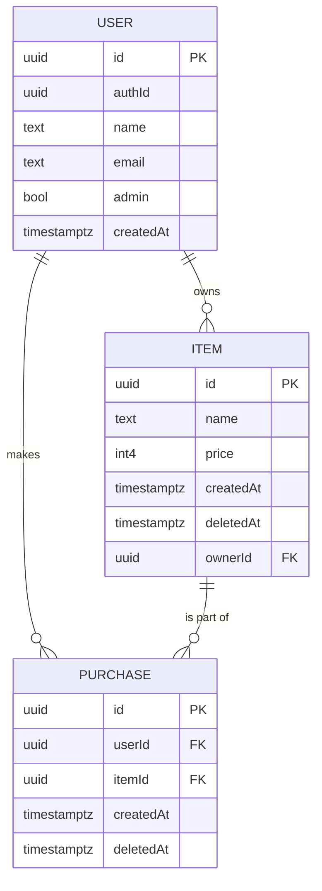

# Z-retailing

## 概要

https://y-demo.toririm.com/

サークル内の物品販売を記録するWebアプリ
このアプリでは、「ユーザー」と「管理者」の2つのロールがあります。
ロール別に可能な内容を以下に示します。

### ユーザー
ユーザー画面から次の操作が可能です

- ログインして、購入した物品を記録
- 自分の購入記録を閲覧
- 他人の購入記録を匿名で閲覧

### 管理者
このデモではデフォルトでユーザーが管理者に設定されています。

管理画面から以下の操作が可能です

- アイテムの追加
- ユーザー別の購入記録詳細を閲覧
- 匿名でない全購入記録を閲覧


## Prerequisites

- Cloudflare Pages
- Supabase
- Prisma Accelerate
- Bun
- Remix

## Set database timezone

```sql
alter database postgres
set timezone to 'Asia/Tokyo';
```

## ページ遷移



## ER図

